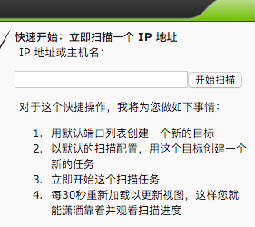
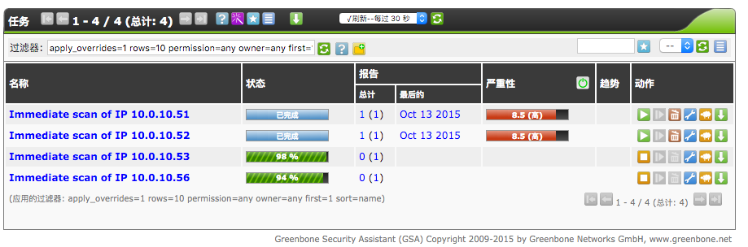
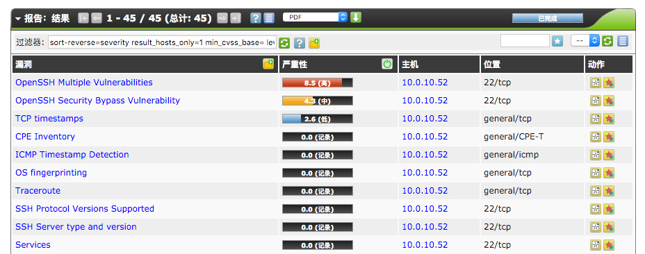

# openvas 进行服务器安全检测

## 简述

使用 `openvas` 进行客户服务器的安全检测, 为方便部署, 使用了 `docker`.

## 部署

使用 `mikesplain/openvas` 这个 **docker image**.

由于我们的客户使用的大多数都是内网服务器, 故部分客户我们无法通过公网进行安全检测, 我们在已经部署了 `openvpn` 并且链接到了公司的 `vpn` 的网段的服务器进行安全检测.

**注意: 需要在使用中增加 `--net=host` 参数**

如下:

```
docker run \
	-d \
	--name openvas \
	--net host \
	-p 443:443 \
	-p 9390:9390 \
	-p 9391:9391 \
	mikesplain/openvas
```

## 检测

检测步骤如下:


* 打开部署了 `openvas` 服务的站点: https://ip-of-openvas

* 页面提示 **https** 证书错误, 请增加到浏览器异常区域中 (不同浏览器异常页面不同, 请自行解决)

* 登录 `openvas` (账号/密码: admin/openvas)

* 如下输入框中输入需要安全检测的服务器 **vpn ip** 地址, 后点击 `开始扫描` 进行扫描



如无法找到如上页面, 点击  即可


* 扫描进度会在 `扫描管理` 分类下列表显示, 如下:



* 扫描完成后, 点击扫描列表中 `报告分类` 下的 `最后的`(此处翻译应为 **最后一次扫描结果**) 即可查看:



* 可以点击报告页面的  按钮下载报告

## 备注

**docker image** 对应的 **Dockerfile** 项目已 **fork** 到了 [这里](https://github.com/genee-tools/openvas-docker), 请查看
